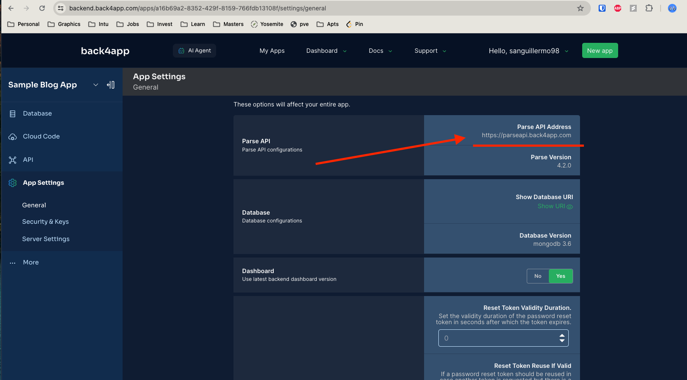
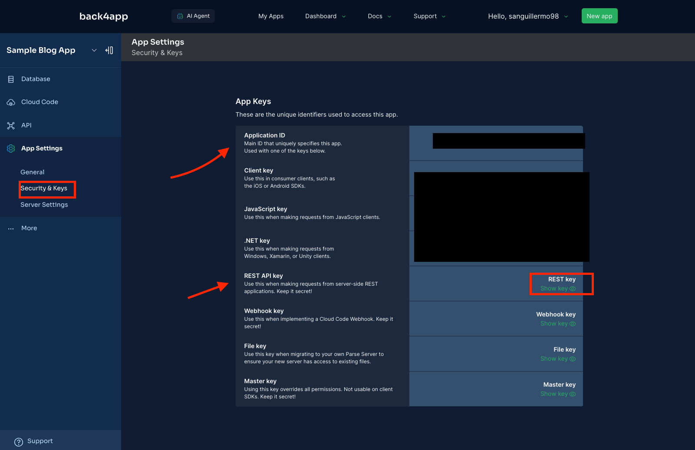

# Flask Mongodb (hosted on Back4App) Starter

Starter app for connecting flask app with mongo db hosted on Back4app (free DB)

Why create this template?
- Back4app provides a free mongodb
- There are no python resources on how to create a backend service that connects to Back4app (until this one)

**Sample Demo**

## Before you Clone this repo

1. Create Back4app.com account and create a sample database and collection
2. In Back4app.com, obtain your credentials for the parse_service.py from these places:
   - API Server URL
     - 
   - App ID and Rest API Key
     - 

## Run it!

1. Install requirements `pip install -U flask requests`
1. Run it! `python app.py`

**Test it out!**

```bash
curl --location 'http://localhost:5000/food' \
--header 'Content-Type: application/json' \
--data '{
    "food": "sushi"
}'
```

### Documentation for Back4app Rest API 

Want to do more?
Here is the offical Rest API documentation for Parse: https://docs.parseplatform.org/rest/guide/


